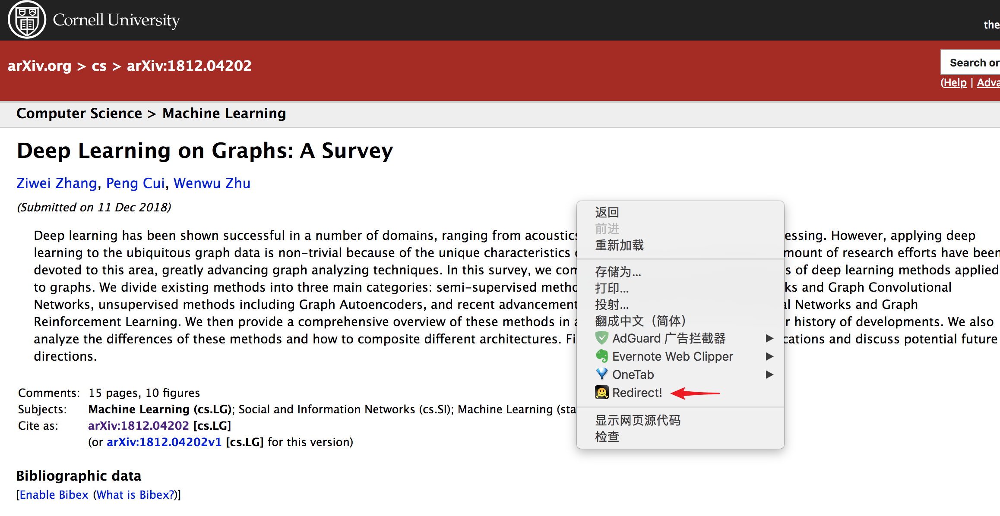

> Chrome Extension: Redirect from arxiv to cn.arxiv PDF which is convenient for China users.

### Reasons:
1. arxiv is not fast enough in China mainland, especially when loading PDF page.

2. Searching an article in Google, Bing and Baidu either on web search or academic search, it doesn't search on mirror of arxiv despite the China arxiv mirror is fast.

### Introductions:

`Arxiv Redirector` is a chrome extension intergrated in context menu, which is able to redirect from `https://arxiv.org` **abs**tract page to `http://cn.arxiv.org` **pdf** page.

`http://cn.arxiv.org` is the very fast mirror of arxiv in China.

Therefore, you can search on ordinary search engine -> if the article is on arxiv, enter arxiv.org -> if you want to take a quick look at it or download, right click and select `Redirect!` -> enjoy it!

When you are on `arxiv` pdf page, click `Redirect!`, the page will reload to `cn.arxiv`.

### Installation:
[Chrome Webstore]()

### Contribution:
tianchunlin123@gmail.com

### Licence:
3-clause BSD licence