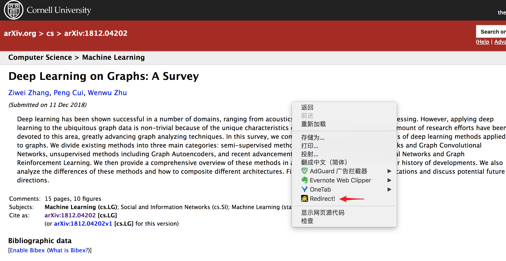

[English README](README-en.md)

> 一个从 `arxiv` 的摘要页跳转到国内镜像`cn.arxiv` 的PDF 页的Chrome浏览器扩展。

### 为什么？
1. `arxiv` 在中国大陆访问速度不快，尤其在加载 PDF 文档时，相当耗时。

2. 我们一般在谷歌，必应，百度的网页搜索或学术搜索上搜索论文，但是如果不给搜索引擎传递参数，一般不会搜索 `arxiv` 的镜像站。

3. arxiv 的国内镜像站`cn.arxiv`访问速度很快。

### 使用指南：
`Arxiv Redirector` 是一个集成在 Chrome 浏览器右键的扩展，使用非常方便。

使用时，如果搜索的论文在 `arxiv` 上，则进入 `arxiv` 的摘要页（abs 页），点击右键，选择`Redirect!`，就会打开新的标签页，并加载 PDF 文档。

在`arxiv`的pdf页面，按`Redirect!`可以在本页面转到`cn.arxiv`的pdf页。

注意：有时`cn.arxiv`上面的LaTex并没有编译为pdf，此时需要稍等片刻（约10s），等待其转为pdf。

### 安装：
[Chrome Webstore]()

### 联系：
tianchunlin123@gmail.com

### 协议:
3-clause BSD licence